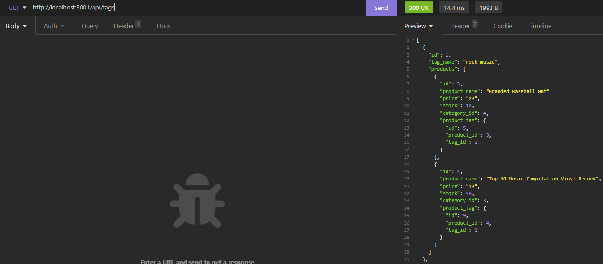

# E-Commerce-Back-End
E-Commerce Back End is the largest sector of the electronics industry, generating an estimated $29 trillion in 2019. E-commerce platforms like Shopify and WooCommerce provide a suite of services to businesses of all sizes. 

## Table of Content

  - [Feature](#feature)
  - [Installation](#installation)
  - [Usage](#usage)
  - [Credits](#credits)
  - [License](#license)

## Feature

Served as a E-commerce system backend API calls

## Installation

Step 1: Clone the repo (HTTPS: `git clone https://github.com/louieiply/Employee-Tracker-Management-System.git` or SSH: `git@github.com:louieiply/Employee-Tracker-Management-System.git`)

Step 2: Install Node.js

Step 3: npm i (install all components from the package.json)

## Usage

### Video

Demonstration link [Click me](https://youtu.be/yIhFbJHetSQ)

### Screenshot

Get All Tags

Post Tag

Put Tag

Delete Tag

Get Tag with ID

Post Category

Put Category

Delete Category

Get All Categories

Get Category with ID

Post Product

Put Product

Delete Product

Get All Products

Get Product with ID

## Credits

Github, express.js(npm), mysql2(npm), sequelize(npm), dotenv(npm)

## License
[MIT License - Copyright (c) 2022 Louie Ip](./LICENSE)